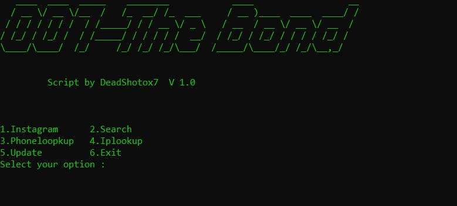

# 007-TheBond

007-TheBond is a Python-based script for performing OSINT (Open Source INTelligence) on targets (friends, family members, your crush who doesn't talk to you and your enemies 😎) using their social media usernames or phone numbers.

## The Script in Action



## Features

1. Instagram OSINT
2. OSINT using phone number
3. Searching for users across social media based on their username
4. Searching the open Web
5. IP Address Lookup

## Usage

### 1. Clone the repository

```
git clone
```

### 2. Enter the **cloned** directory

```
cd 007-TheBond
```

### 3. Create a virtual environment and activate the environment

```
# for Unix (MacOS and Linux) users:
python -m venv venv
source venv/bin/activate

# for Windows users:
python -m venv venv
venv\Scripts\activate
```

### 4. Install the required packages

```
pip install -r requirements.txt
```
or run `setup.sh`
```
./setup.sh
```
### 5. Run the Script 
```
python 007-TheBond.py
```

## Testing

007-TheBond has been tested successfully on these operating systems:

1. Kali Linux
2. Parrot Linux
3. Termux (pending issue with finding Instagram users)
4. Garuda Linux

## Version

The latest version of 007-TheBond is 2.0 - this is the latest official release of this project.

## Stars, Forks and Pull Requests

Starring this repository would be wonderful, and anyone is welcome to fork this project and add your contributions through pull requests 🙂

## Connect With Us

Join our <a href='https://discord.gg/WAhQ8EcV4C'>Discord server</a> to get the latest updates and announcements on 007-TheBond.

## Discussion

If you have any ideas or suggestions for 007-TheBond, let us know in the Discussions tab of this GitHub repository. Your views and thoughts are highly appreaciated. 🙌

## Sponsors And Donations

007-TheBond is maintained by a single developer (with contributions from the Open Source community). You can support this project by sponsoring it. This helps the developer bring amazing new features!

- https://www.buymeacoffee.com/Deadshot0x7
- http://www.ko-fi.com/deadshot0x7
- https://paypal.me/Deadshot0x7?locale.x=en_GB

Google UPI - sviquarahmed@okaxis

## Disclaimer

<a href='https://github.com/Deadshot0x7'>@DeadShot0x7</a> is not responsible for any damages caused by misuse of 007-TheBond (hereinafter referred to as "the script") and any products built using it. You are solely responsible for your usage of this script.

## Website

[](https://app.netlify.com/sites/007-thebond/deploys)

## Product Hunt

<a href="https://www.producthunt.com/posts/007-thebond?utm_source=badge-review&utm_medium=badge&utm_souce=badge-007-thebond#discussion-body" target="_blank"></a>